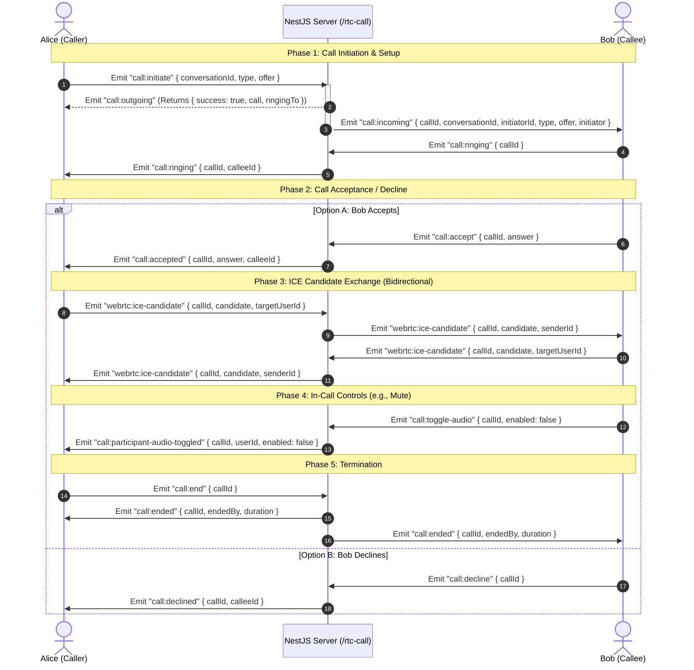

# Frontend Integration Guide: WebRTC RTC Call

This document provides a comprehensive guide for frontend and mobile developers to integrate WebRTC voice and video calls using our NestJS server's WebSocket gateway and REST endpoints.

**Namespace**: `/rtc-call` (Connect via this path)  
**Authentication**: Valid JWT Bearer token required in the connection handshake.

---

## 1. Connection Example

Pass the token via the `auth` object when establishing the connection.

```javascript
import { io } from 'socket.io-client';

const rtcSocket = io('http://your-api-url/rtc-call', {
  auth: {
    token: 'Bearer YOUR_JWT_TOKEN',
  },
});

rtcSocket.on('connect', () => {
  console.log('Connected to RTC Gateway!', rtcSocket.id);
});

rtcSocket.on('connect_error', (err) => {
  console.error('RTC Connection failed:', err.message);
});
```

---

## 2. HTTP REST Endpoints

Use these REST API endpoints for loading historical call logs. All endpoints are protected by `JwtAuthGuard` and require the `Authorization: Bearer YOUR_JWT_TOKEN` header.

### Get Call History (All User Calls)
- **Path**: `GET /rtc-call/history`
- **Description**: Returns all calls where the user was the initiator or a participant.
- **Response**:
  ```json
  [
    {
      "id": "call-uuid",
      "conversationId": "conversation-uuid",
      "initiatorId": "user-uuid",
      "type": "VIDEO", // VOICE or VIDEO
      "status": "ENDED", // INITIATED, RINGING, ACTIVE, ENDED, MISSED, DECLINED, FAILED
      "startedAt": "2026-06-03T10:00:00.000Z",
      "endedAt": "2026-06-03T10:15:30.000Z",
      "duration": 930, // in seconds
      "createdAt": "2026-06-03T09:59:45.000Z",
      "initiator": {
        "id": "user-uuid",
        "name": "Alice",
        "fullName": "Alice Smith",
        "profilePhoto": "https://example.com/alice.jpg"
      },
      "participants": [
        {
          "id": "participant-record-uuid",
          "userId": "bob-uuid",
          "joinedAt": "2026-06-03T10:00:02.000Z",
          "leftAt": "2026-06-03T10:15:30.000Z",
          "duration": 928,
          "user": {
            "id": "bob-uuid",
            "name": "Bob",
            "fullName": "Bob Jones",
            "profilePhoto": null
          }
        }
      ]
    }
  ]
  ```

### Get Call History by Conversation
- **Path**: `GET /rtc-call/conversation/:conversationId`
- **Description**: Returns call logs within a specific conversation.

### Get Call Details by ID
- **Path**: `GET /rtc-call/:id`
- **Description**: Returns detailed statistics and participants for a single call session.

---

## 3. WebSockets Events Reference

### 3.1 Call Lifecycle Events

| Client Emit Event | Server Response / Listener | Payload / Parameters | Description |
| :--- | :--- | :--- | :--- |
| `call:initiate` | `call:incoming` (to callee)<br>`call:outgoing` (to you, returns Call) | `{ conversationId: UUID, type: CallType, offer?: string }` | Initiates a call session. The SDP `offer` is saved. |
| `call:ringing` | `call:ringing` (to caller) | `{ callId: UUID }` | Callee client notifies the server they are ringing. |
| `call:accept` | `call:accepted` (to caller) | `{ callId: UUID, answer: string }` | Callee accepts the call, passing the WebRTC SDP `answer`. |
| `call:decline` | `call:declined` (to caller) | `{ callId: UUID }` | Callee declines/rejects the call. |
| `call:end` | `call:ended` (to all participants) | `{ callId: UUID }` | Any participant ends the active call. |

### 3.2 WebRTC Signaling Relay

Signaling events are direct peer-to-peer relays through the server namespace.

| Client Emit Event | Server Listener / Relay | Payload / Parameters | Description |
| :--- | :--- | :--- | :--- |
| `webrtc:offer` | `webrtc:offer` (to target) | `{ callId: UUID, offer: string, targetUserId: UUID }` | Relays WebRTC SDP offer directly to target user. |
| `webrtc:answer` | `webrtc:answer` (to target) | `{ callId: UUID, answer: string, targetUserId: UUID }` | Relays WebRTC SDP answer directly to target user. |
| `webrtc:ice-candidate` | `webrtc:ice-candidate` (to target) | `{ callId: UUID, candidate: string, targetUserId: UUID }` | Relays and persists a new ICE candidate. |

### 3.3 In-Call Controls

| Client Emit Event | Server Listener / Relay | Payload / Parameters | Description |
| :--- | :--- | :--- | :--- |
| `call:toggle-audio` | `call:participant-audio-toggled` (to others) | `{ callId: UUID, enabled: boolean }` | Notifies others if you muted/unmuted your microphone. |
| `call:toggle-video` | `call:participant-video-toggled` (to others) | `{ callId: UUID, enabled: boolean }` | Notifies others if you turned your video on/off. |
| `call:toggle-screenshare` | `call:participant-screenshare-toggled` (to others) | `{ callId: UUID, enabled: boolean }` | Notifies others if you toggled screensharing. |

---

## 4. Payload Details & Explanations

### Call Initiation & Reception

**Initiate a Call**  
*Emit*: `call:initiate`
```json
{
  "conversationId": "conversation-uuid",
  "type": "VIDEO", // VOICE or VIDEO
  "offer": "SDP offer string..."
}
```

**Incoming Call Alert**  
*Listen*: `call:incoming`
```json
{
  "callId": "call-uuid",
  "conversationId": "conversation-uuid",
  "initiatorId": "user-uuid",
  "type": "VIDEO",
  "offer": "SDP offer string...",
  "initiator": {
    "id": "user-uuid",
    "name": "Alice",
    "fullName": "Alice Smith",
    "profilePhoto": "https://example.com/alice.jpg"
  }
}
```

**Outgoing Call Confirmation (to Caller)**  
*Listen*: `call:outgoing`
```json
{
  "success": true,
  "call": {
    "id": "call-uuid",
    "conversationId": "conversation-uuid",
    "initiatorId": "user-uuid",
    "type": "VIDEO",
    "status": "INITIATED",
    "offer": "SDP offer string...",
    "createdAt": "2026-06-03T09:59:45.000Z"
  },
  "ringingTo": ["callee-user-uuid"]
}
```

---

### Ringing Feedback

**Callee Device Ringing**  
*Emit*: `call:ringing`
```json
{
  "callId": "call-uuid"
}
```

**Ringing Notification (to Caller)**  
*Listen*: `call:ringing`
```json
{
  "callId": "call-uuid",
  "calleeId": "callee-user-uuid"
}
```

---

### Accepting & Connecting

**Accept Incoming Call**  
*Emit*: `call:accept`
```json
{
  "callId": "call-uuid",
  "answer": "SDP answer string..."
}
```

**Call Accepted Notification (to Caller)**  
*Listen*: `call:accepted`
```json
{
  "callId": "call-uuid",
  "answer": "SDP answer string...",
  "calleeId": "callee-user-uuid"
}
```

---

### Declining & Ending

**Decline/Reject Call**  
*Emit*: `call:decline`
```json
{
  "callId": "call-uuid"
}
```

**Call Declined Notification (to Caller)**  
*Listen*: `call:declined`
```json
{
  "callId": "call-uuid",
  "calleeId": "callee-user-uuid"
}
```

**End Active Call**  
*Emit*: `call:end`
```json
{
  "callId": "call-uuid"
}
```

**Call Ended Notification**  
*Listen*: `call:ended`
```json
{
  "callId": "call-uuid",
  "endedBy": "user-uuid",
  "duration": 930
}
```

---

### WebRTC Signaling Relay

**Relay WebRTC Offer/Answer/ICE Candidates**  
*Emit*: `webrtc:offer`, `webrtc:answer`, or `webrtc:ice-candidate`
```json
{
  "callId": "call-uuid",
  "offer": "SDP content...", // or "answer" or "candidate"
  "targetUserId": "recipient-user-uuid"
}
```

**Receive Relayed WebRTC Offer/Answer/ICE Candidates**  
*Listen*: `webrtc:offer`, `webrtc:answer`, or `webrtc:ice-candidate`
```json
{
  "callId": "call-uuid",
  "offer": "SDP content...", // or "answer" or "candidate"
  "senderId": "sender-user-uuid"
}
```

---

### In-Call Controls

**Toggle Call Actions (Audio/Video/Screenshare)**  
*Emit*: `call:toggle-audio`, `call:toggle-video`, or `call:toggle-screenshare`
```json
{
  "callId": "call-uuid",
  "enabled": false
}
```

**Participant Action Toggled**  
*Listen*: `call:participant-audio-toggled`, `call:participant-video-toggled`, or `call:participant-screenshare-toggled`
```json
{
  "callId": "call-uuid",
  "userId": "user-uuid-who-toggled",
  "enabled": false
}
```

---

## 5. Example WebRTC Calling Flow

### 5.1 Sequence Diagram



### 5.2 Flow Details

#### Phase 1: Call Setup (SDP Exchange)
1. **Alice** (caller) emits `call:initiate` with target `conversationId`, `type: 'VIDEO'`, and her local WebRTC SDP `offer`.
2. **Server** creates the database call record, joins Alice as a participant, emits `call:outgoing` back to Alice to acknowledge, and emits `call:incoming` to **Bob** (callee) with Alice's `offer` and profile info.
3. **Bob's** client receives `call:incoming`, plays the ringtone, and emits `call:ringing` back to the server.
4. **Server** relays `call:ringing` to **Alice** so her screen displays "Ringing...".

#### Phase 2: Connection Establishment
1. **Bob** clicks "Accept". His client creates a WebRTC answer and emits `call:accept` with his SDP `answer`.
2. **Server** updates the call status to `ACTIVE`, joins Bob as a participant, and relays `call:accepted` to **Alice** with Bob's SDP `answer`.
3. **Alice** and **Bob** establish direct WebRTC connection.

#### Phase 3: ICE Candidate Exchange
1. Both clients gather ICE candidates and emit `webrtc:ice-candidate` with the candidate details and the target's `userId`.
2. **Server** saves these candidates to the database for call auditing and relays them immediately via `webrtc:ice-candidate` to the target.

#### Phase 4: Active Controls & Call Termination
1. If Bob mutes himself, his client emits `call:toggle-audio` with `enabled: false`. Alice receives `call:participant-audio-toggled` to update Bob's mute icon.
2. When Alice clicks "Hang up", her client emits `call:end`.
3. **Server** updates the call status to `ENDED`, calculates participant durations, and emits `call:ended` to all users in the conversation.
